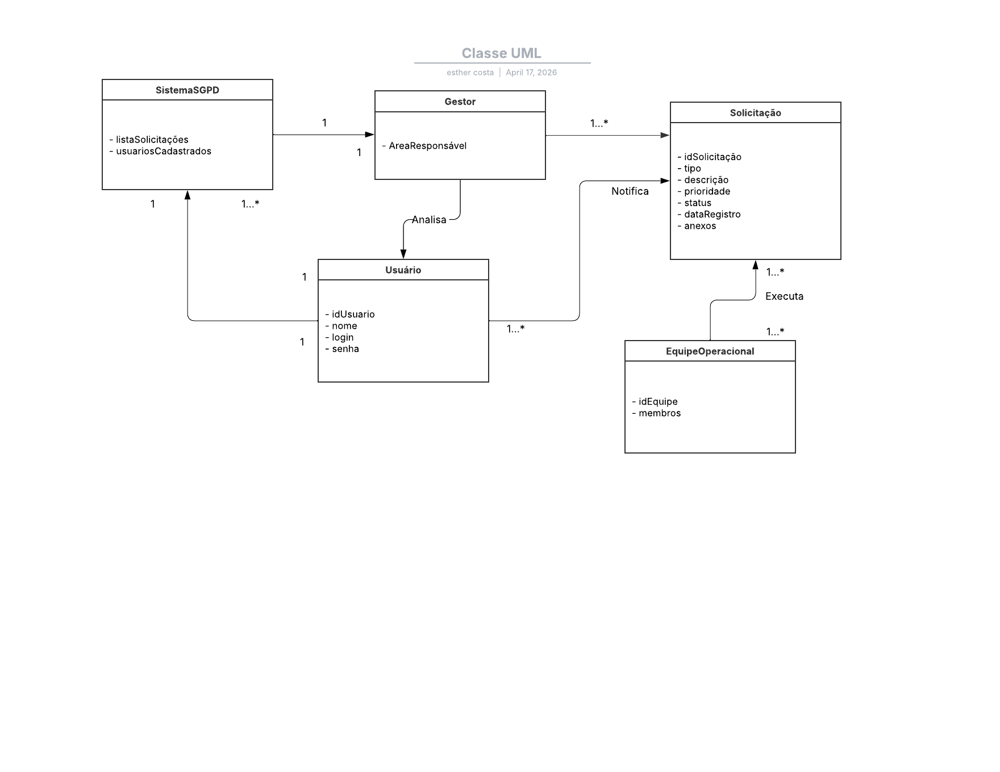

# Prototipagem de Sistemas Computacionais
Modelagem UML - Sistema de Gestão de Projetos

Este repositório reúne os diagramas UML desenvolvidos para o Sistema de Gestão de Pedido Digital (SGPD).

## Objetivo
Validar a arquitetura estrutural e comportamental do SGPD antes da codificação, garantindo consistência e minimizando falhas arquiteturais.

## 📑 Diagrama de Classes

**Explicação:**  
O diagrama de classes define a estrutura estática do sistema, incluindo classes como **Solicitação**, **SistemaSGPD**, **Usuário** e **Gestor**.  
- Atributos: `idSolicitacao`, `tipo`, `descricao`, `status`.  
- Métodos: `validarCampos()`, `registrarSolicitacao()`, `gerarNumeroProtocolo()`.  
Esses métodos são invocados nos diagramas comportamentais.

---

## 📑 Diagrama de Sequência

**Explicação:**  
Mostra a ordem temporal das interações entre os objetos no caso de uso **Registrar Solicitação Digital**.  
- O **Solicitante** envia `preencherFormulario()`.  
- O **SistemaSGPD** chama `validarCampos()` na classe **Solicitação`.  
- Em seguida, executa `registrarSolicitacao()` e notifica o **Gestor**.  

---

## 📑 Diagrama de Atividades

**Explicação:**  
Representa o fluxo de controle e decisões do processo de negócio.  
- Decisão: “Credenciais válidas?” → se não, retorna ao início.  
- Decisão: “Dados completos?” → se não, retorna ao preenchimento.  
- Paralelismo: após o registro, o sistema **notifica o gestor** e **confirma ao solicitante** simultaneamente.  

---

## 📑 Complementaridade dos Modelos
O diagrama de classes fornece os métodos e atributos que são invocados no diagrama de sequência e traduzidos em ações no diagrama de atividades.  
- Classe **Solicitação** → atributo `status`.  
- Diagrama de sequência → mensagem `atualizarStatus("Aguardando Aprovação")`.  
- Diagrama de atividades → ação “Registrar Solicitação” seguida da decisão “Solicitação registrada com sucesso”.

---

## 📑 Reflexão sobre a Aprendizagem
- **Pontos fortes:** clareza na modelagem, consistência entre diagramas.  
- **Oportunidades de melhoria:** detalhar cenários alternativos e exceções.  
- **Contribuições profissionais:** maior competência em análise sistêmica e documentação técnica.  

## Autor
Esther — Abril/2026
